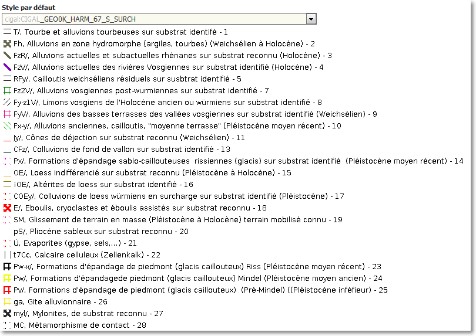
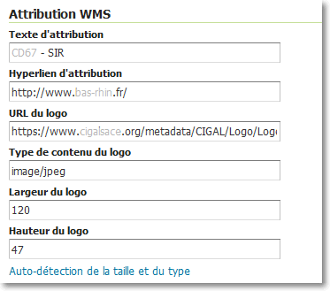
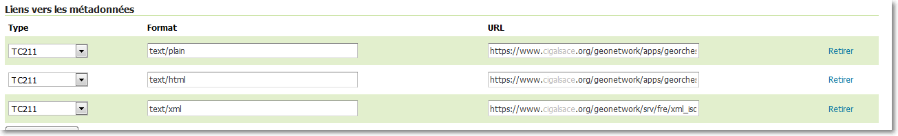
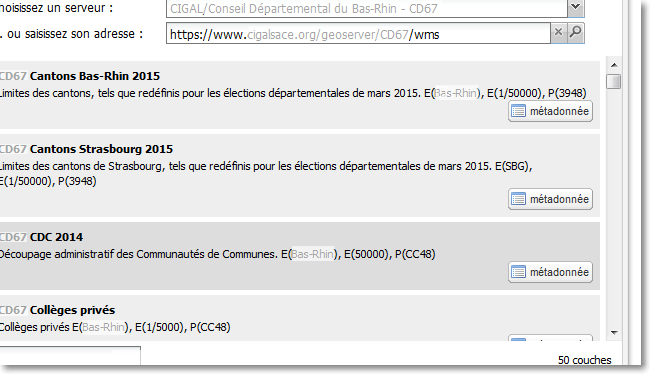

# Documentation officielle
http://docs.geoserver.org/stable/en/user/data/index.html#data

Vous pouvez publier telles quelles les données dans Geoserver mais vous avez aussi de nombreuses possibilités d'optimisations.

# En améliorant les performances.

Postgis+spatial index>shapefile pour des fichiers vecteurs volumineux

Utiliser Image Pyramide ou BigTif avec overview pour du Raster. Se référer à http://www.slideshare.net/geosolutions/geoserver-on-steroids-foss4g-2015

Utilisation du GeoWebCache
http://docs.geoserver.org/stable/en/user/geowebcache/

# En stylisant la donnée (SLD)

->onglet publication

Exemples

https://github.com/sigrennesmetropole/geoserver_sld

https://github.com/geobretagne/SLD

https://github.com/cigalsace/processes/tree/master/sld

Liste d'outils pour travailler du sld
- [Styler Mapfishapp](https://sdi.georchestra.org/mapfishapp/)
- [qgis](http://www.qgis.org)
- [Java Sld Editor](https://github.com/robward-scisys/sldeditor)
- [Atlas Styler](http://www.geopublishing.org/)

# En mentionnant les sources

->onglet publication

# Et surtout la métadonnée!!

Le format text/html est obligatoire pour l'icône "métadonnée"dans la fenêtre de recherche des couches Mapfishapp

# Liens divers
https://github.com/cigalsace/documentation/tree/master/guide_prepa_publication_raster

https://github.com/cigalsace/documentation/tree/master/tuto_prepa_publication_raster
