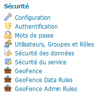

# Geofence

Depuis GS 2.6 Geofence est intégré à Geoserver (menu de gauche).

Le tutoriel GeoServer
http://docs.geoserver.org/latest/en/user/community/geofence-server/tutorial.html

Geofence donne des possibilités avancées pour sécuriser les services.
- découpler le WMS du WFS
- filtre géographique
- filtre attributaire
- administration déléguée sur un espace de nommage

# Liens divers

https://github.com/cigalsace/documentation/tree/master/guide_admin_delegue_geoserver
