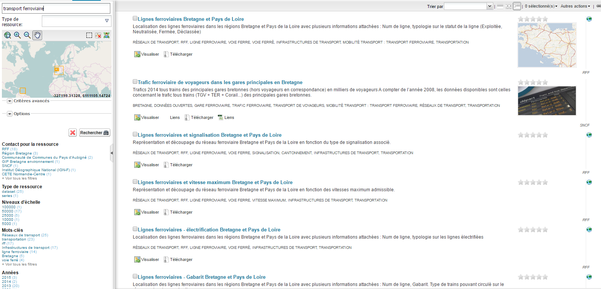

# Trouver une donnée via ses métadonnées

GeOrchestra utilise la solution GeoNetwork, voici un exemple de page d'accueil :

Pour trouver une donnée, il faut saisir un mot clé (ou plusieurs dans ce cas il faudra que tous les mots clés collent avec la donnée). Exemple ici avec les mots clés "transport" et "ferroviaire" :

